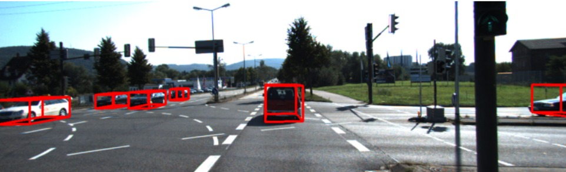

# 3D Object Estimation Using Deep Learning and Geometric Constraints

In this repository i explain a technique for **3D object estimation** from a single image. My approach combines **deep convolutional neural networks** with **geometric constraints** derived from 2D bounding boxes to generate accurate and robust 3D bounding boxes. The proposed technique has been evaluated using a subset of the **KITTI dataset**.

---

## Overview

### Key Features:
1. **Stable 3D Object Attributes**:
   - Predicted using a deep convolutional neural network.
   - These attributes serve as the foundation for constructing accurate 3D bounding boxes.
2. **Integration of Geometric Constraints**:
   - Uses 2D bounding box information to refine 3D object estimations.
3. **Evaluation**:
   - Visual inspection of the projected 3D bounding boxes in test images.
   - Performance metrics emphasize alignment accuracy, object location, and orientation stability.

---

## Dataset: KITTI Subset

The proposed technique is evaluated using a subset of the **KITTI dataset**, which includes:
- **Labeled Images**: Contain 2D and 3D bounding box annotations.
- **Unlabeled Test Images**: Used for performance evaluation.
- **Calibration Data**: Essential for geometric constraints and accurate projections.

### Dataset Features:
- Variety of object scales and orientations.
- Challenging scenes with congested areas and occlusions.
- Ground truth labels for accurate performance analysis.

---

## Workflow

### 1. Deep Learning-Based 3D Attribute Prediction
- A deep convolutional neural network is trained on the KITTI dataset to predict:
  - Object location in 3D space.
  - Object dimensions (width, height, depth).
  - Orientation angles.

### 2. Geometric Constraints
- Derived from the 2D bounding boxes.
- Ensure alignment and stability of the 3D bounding boxes with real-world object locations.

### 3. 3D Bounding Box Projection
- Combines deep learning outputs with geometric constraints.
- Generates accurate 3D bounding boxes visualized on the test images.

### 4. Evaluation
- Performance evaluated through:
  - Visual alignment accuracy.
  - Stability of object locations and orientations.
  - Robustness across different scales and crowded scenes.

---

## Results

### Key Outcomes:
- **Robustness**: Consistently generates reliable 3D bounding boxes across varying object scales and crowded locations.
- **Accuracy**: Shows strong alignment of projected 3D bounding boxes with actual objects.
- **Challenges**:
  - Slight misalignment at extreme orientations.
  - Less precise results in heavily chaotic scenes.
